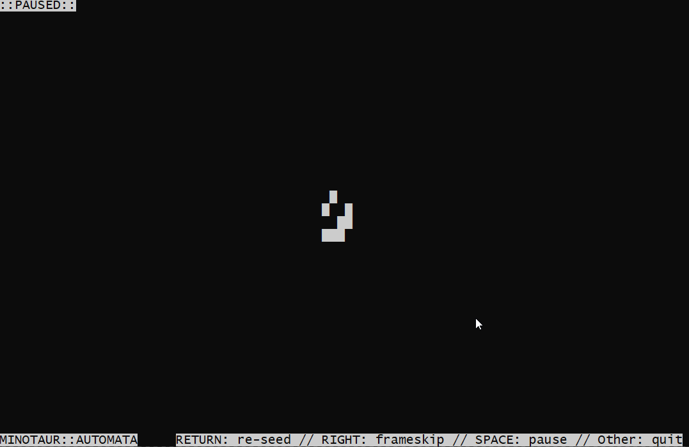

# MinotaurAutomata

Cellular automatas generated labyrinthic patterns

## Hilights

The `automatas` module is decoupled from any labyrinth related stuff, and
provide simple yet powerful way to experiment with binary cellular automatas of
any kind. Everything has docstrings, comments, and illustrative exemples, so it
should be pleasant to work with it. :)

The `labyrinths` module impements specific cellular automatas related to
labyrinthic pattern generation.

Those two first modules were designed to be used as pedagogic material, so I
tried to make them as exemplary and easy to understand as I could. If something
sounds unclear, let me know.

Finally, the `minotaur` module is a simple, quick-and-dirty CLI application
that generates labyrinths in your terminal, because hey, I heard that's what
the cool kids are doing those days.

## Installation

This module needs Python 3.

- Clone this repo:

  `git clone https://github.com/LeMinaw/MinotaurAutomata`

- Install requirements:

  `python -m pip install requirements.txt`

- Done!

## Running the demo

Simply run `minotaur` as any python script:

`python ./minautor.py`

The `automatas` and `labyrinths` modules provide basic text output when running
them as scripts (eg. `python ./automatas.py`) to showcase them, however, it's
more convenient (and enjoyable!) to run the dedicated CLI app. :)
